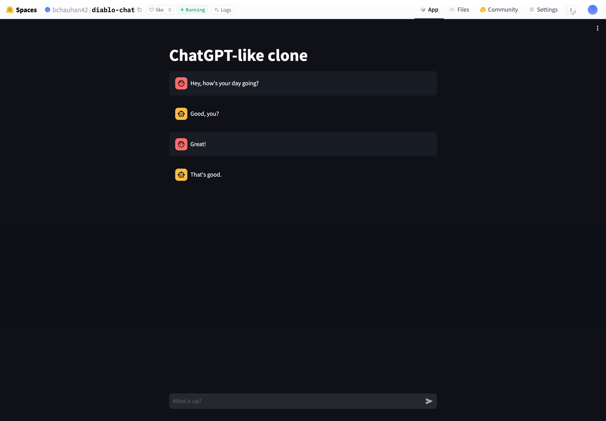

# Project Overview

This project is a chatbot application that uses the open-source DialoGPT-large model from Microsoft, hosted on Hugging Face's serverless spaces API. The chatbot is built with Python and Streamlit, and the project is hosted on Hugging Face Spaces.

The project can be accessed at the following URL: [Chatbot Application](https://huggingface.co/spaces/bchauhan42/diablo-chat) 

If it shows an error, wait a few seconds and reload the page. If no one has used the chatbot for a while, the model take a few seconds to load up.
## Code Explanation

The project's code is written in Python and uses the Streamlit library to create a web-based user interface for the chatbot. The chatbot itself is powered by the DialoGPT-large model from Microsoft, which is a state-of-the-art language model trained on a large corpus of internet text.

The DialoGPT-large model is hosted on Hugging Face's serverless spaces API, which provides a scalable and easy-to-use platform for deploying machine learning models. The project uses the `requests` library to send HTTP requests to the Hugging Face API, passing the entire conversation history to the model and receiving the model's generated response.

The project's code is structured as follows:

- The Streamlit library is used to create a web-based user interface for the chatbot. This includes a text input field for the user's input and a chat message container to display the conversation history.
- The Hugging Face API is used to interact with the DialoGPT-large model. The API's URL and authorization headers are defined, and a `query` function is implemented to send requests to the API.
- The `query` function sends the entire conversation history to the DialoGPT-large model via the Hugging Face API and receives the model's generated response. The response is then displayed in the chat message container and added to the conversation history.

## Hosting on Hugging Face Spaces

The project is hosted on Hugging Face Spaces, which is a platform that allows you to host and share your Streamlit applications directly from your Hugging Face account. Hugging Face Spaces integrates seamlessly with your Hugging Face workflow, making it easy to deploy your Streamlit applications and share them with others.

To view the project, you can navigate to the project's Hugging Face Spaces URL. From there, you can interact with the chatbot by entering your input into the text input field and viewing the model's responses in the chat message container.

## Example Image

This is what the chatbot application looks like:
